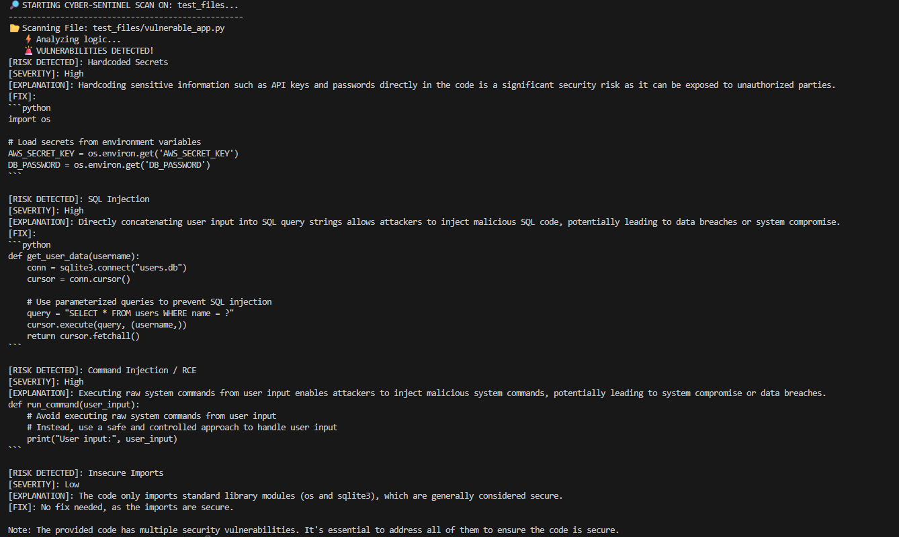

# 🛡️ Cyber-Sentinel
AI-Assisted Static Security Analyzer for Python Code

## 🚀 Overview
Cyber-Sentinel is an AI-powered static analysis tool that detects
common security vulnerabilities in Python source code and provides
context-aware remediation suggestions.

Unlike traditional rule-based scanners, Cyber-Sentinel leverages
large language models to understand **code intent**, reducing
false positives and improving detection of logical security flaws.

---

## 🎯 Problem Statement
Traditional static analysis tools:
- Generate high false positives
- Fail to understand business logic
- Miss context-dependent vulnerabilities

Cyber-Sentinel addresses this gap by combining:
- Lightweight static scanning
- LLM-based semantic analysis
- Actionable fix suggestions

---

## 🔍 Vulnerabilities Covered
- Hardcoded secrets
- Insecure use of `eval()` / `exec()`
- SQL injection patterns
- Command injection
- Weak cryptographic usage
- Insecure file handling

---

## 🧠 System Architecture
1. Source code ingestion
2. Rule-based pre-scan (baseline)
3. LLM-assisted semantic analysis
4. Vulnerability classification
5. Remediation suggestion generation

---

## 🧪 Evaluation Strategy
Cyber-Sentinel is evaluated using:
- Precision vs rule-based baseline
- False positive comparison
- Manual validation on vulnerable test cases

**Goal:** Reduce false positives while maintaining high recall.

---

## 📦 Tech Stack
- Python
- LangChain
- LLaMA-3-70B (via Groq API)
- Static code parsing (AST)

---

## ▶️ How to Run
```bash
pip install -r requirements.txt
python main.py --file test_files/vulnerable.py


