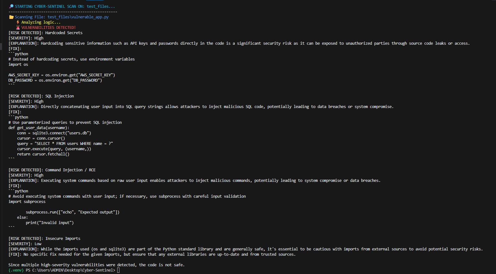

# 🚨 Cyber-Sentinel
**An Autonomous AI-Powered Static Analysis Tool (SAST)**

**Cyber-Sentinel** scans Python codebases for OWASP Top 10 vulnerabilities using advanced LLM reasoning and suggests secure patches automatically.

---

## 💡 Problem
Manual code review is slow, error-prone, and often misses tricky security flaws like SQL injection, hardcoded secrets, or unsafe use of user input.

Developers need a tool that not only identifies risks but also *fixes them intelligently*.

---

## 🧠 Solution
Cyber-Sentinel:
1. Scans local project folders for Python files
2. Detects security vulnerabilities
3. Uses LLM reasoning to generate **safe patched code**
4. Outputs a detailed audit report (with suggested fixes)

This bridges the gap between static scanning and developer-friendly remediation.

---

## 📊 Architecture

Target Codebase
      ↓
[1] Static Scanner
      ↓
[2] AI Security Auditor (LLM)
      ↓
[3] Controlled Remediation & Report Generator
      ↓
SECURITY_AUDIT.md + Patched Code Suggestions

## 🔐 Security & Safety Philosophy

Cyber-Sentinel follows a "trust but verify" approach:
- Deterministic rules first
- AI reasoning second
- Human-controlled remediation always

The system never modifies production code directly.


## 📸 Demo


## 🐳 Docker Deployment
This project is containerized for production consistency.

### How to Run via Docker:
1. **Build the Image:**
   ```bash
   docker build -t cyber-sentinel .